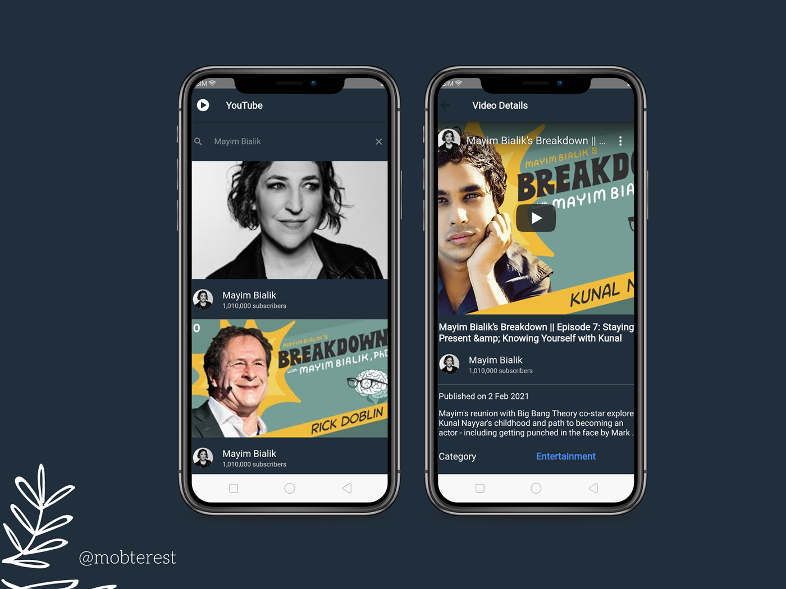

# YouTube Clone App

## Introduction

Built with [React Native](https://reactnative.dev/) :star2:



## Features

 - Designed to enable users to search, displays videos based on the search, plays the selected video and displays the details of the selected video.

## Feedback

- Feel free to send feedback . Feature requests are always welcome. If there's anything you'd like to chat about, please don't hesitate to [reach out](https://www.instagram.com/mobterest/).

## Build process

- Follow the [React Native Guide](https://reactnative.dev/docs/getting-started) to get started in building with Flutter.
- Clone or download the repo.
- Invoke the ``` npx react-native start ``` command.

## Acknowledgements

Thanks to [React Native](https://reactnative.dev/) and [Visual Studio Code](https://code.visualstudio.com/) for supporting us with amazing products.